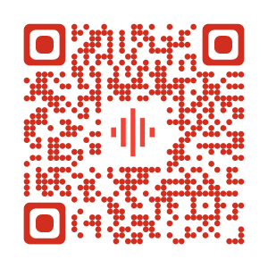

# Voicescriber

 

## Overview
***This Web application JS ES6/8 project is currently under development***

Voice Scriber is a online tool that uses the API of your browser to record your voice using a microphone and save it on the cloud.

> [Demo](https://voicescriber.firebaseapp.com/)

## Features
- Web application modern and responsive (Material Design).
- Create account with an email.
- Sign in with Google, Twitter and Facebook.
- Data stored in Firebase [Cloud Storage](https://firebase.google.com/products/storage/), [Hosting](https://firebase.google.com/products/hosting/) and [Realtime Database](https://firebase.google.com/products/realtime-database/).
- Recording voice with your device microphone.
- [Player](https://wavesurfer-js.org/) with waveform visualization.
- You can download, rename or delete audio records.
- Import audio record from desktop. (webm, mp3, ogg, aac, wav)
- Share audio records by [short link](https://tiny.ph/) or [QRcode](qrickit.com).
- Sort your audio records 🏗 (dev)
- Add Tags to audio records 🏗 (dev)
- Convert audio record to another format 🏗 (dev)
- Transcript audio record (Speech to Text) 🏗 (dev)

## Technologies
- [JavaScript ES6/8](https://developer.mozilla.org/en-US/docs/Web/JavaScript/Language_Resources) - ECMAScript is the scripting language that forms the basis of JavaScript. ECMAScript standardized by the ECMA International standards.
- [Firebase](https://firebase.google.com/) - Firebase is Google's mobile platform that helps you quickly develop high-quality apps.
- [Materialize](https://materializecss.com/) - Materialize is a modern responsive CSS framework based on Material Design.
- [Gulp](https://gulpjs.com/) - Gulp is a toolkit for automating painful or time-consuming tasks in your development workflow, so you can stop messing around and build something.
- [Babel](https://babeljs.io/) - Babel is a toolchain that is mainly used to convert ECMAScript 2015+ code into a backwards compatible version of JavaScript in current and older browsers or environments.
- [BrowserSync](https://www.browsersync.io/) - Browsersync makes your browser testing workflow faster by synchronising URLs, interactions and code changes across multiple devices.
- [NodeJS](https://nodejs.org/) - Node.js is a JavaScript runtime built on Chrome's V8 JavaScript engine
- [NVM](https://github.com/nvm-sh/nvm) - Node Version Manager - Simple bash script to manage multiple active node.js versions
- [NPM](https://www.npmjs.com/) - Essential JavaScript development tools that help you go to market faster and build powerful applications using modern open source code.

## Quick start
- Run node `$ nvm use 10`
- Install dependencies `$ npm install`
- Run app `$ gulp`
- Navifĝate to `http://localhost:3000`

## Feedback
- [Github](https://github.com/reek/pwa-quick-accident-report/issues) - Report issues.

## Contribute
Contributions are always welcome!
Please submit a [PR](https://github.com/reek/pwa-quick-accident-report/pulls).